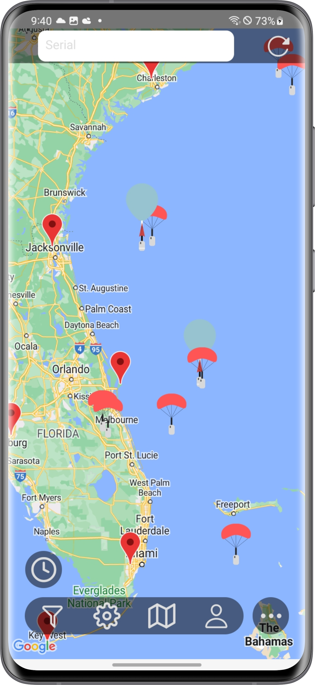
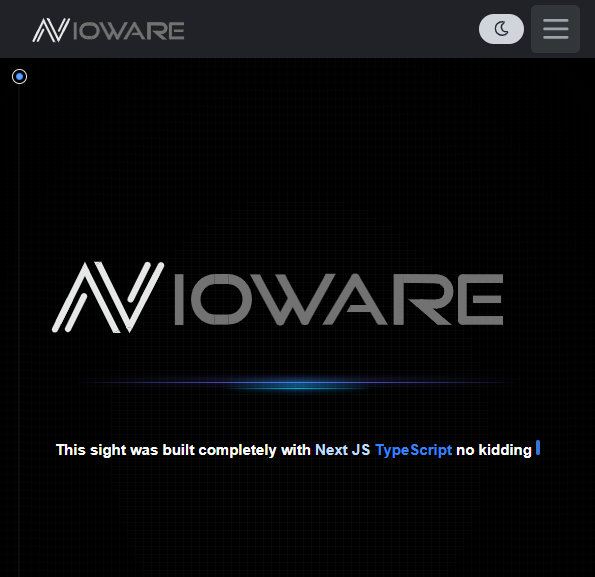

###

  

   
  
<h2>SOCIAL</h2>

  
  

### Languages / Frameworks

    

### Tools / Platforms

    

## My Work

----

### [SondeView](https://www.nvioware.com/sondeview)

  Sondeview is a mobile app that uses Sondehub an Amateur Radio High Altitude Ballooning project with worldwide users that have set up ground stations to receive and upload data from radeiosonds Sondeview uses Sondehub's APIs and caches the data and has live data proxies to take the load of there infistrusher the app is built with react native

### [Become a beta tester](https://www.nvioware.com/sondeview/betaprogram)

    

### [Nvioware.com](https://www.nvioware.com)

    

